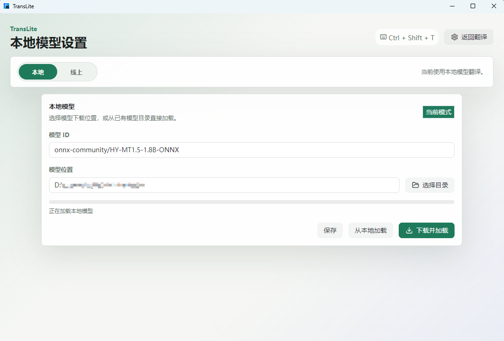
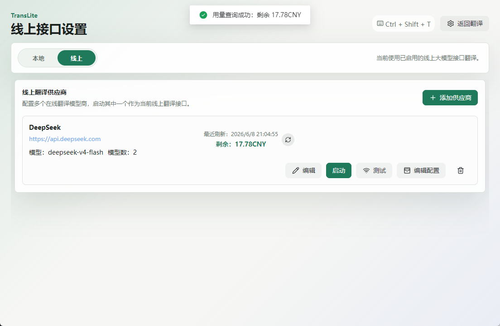

<p align="center">
  
</p>

<h1 align="center">TransLite</h1>

<p align="center">
  轻量化桌面翻译工具，支持 local-trans 模型翻译、线上大模型供应商、全局快捷键唤起和可配置用量查询。
</p>

<p align="center">
  
  
  
  
  
  
</p>

<p align="center">
  <a href="./README.zh-CN.md">中文</a> · <a href="./README.md"><strong>English</strong></a>
</p>

## 概览

TransLite 是一个轻量化桌面翻译工具，面向需要快速翻译、离线翻译和多模型接口切换的用户。本地翻译模式基于 local-trans 的模型方向，默认使用 `onnx-community/HY-MT1.5-1.8B-ONNX` 本地模型。线上模式支持 DeepSeek、GLM、Kimi、OpenAI、Claude、Gemini 等模型供应商和 OpenAI-compatible 网关。

## 应用截图

<p align="center">
  <table>
    <tr>
      <td align="center"><b>翻译工作区</b><br></td>
      <td align="center"><b>供应商设置</b><br></td>
    </tr>
  </table>
</p>

## 功能特性

- 全局快捷键快速打开翻译界面。
- 支持 local-trans 模型下载、选择模型目录、加载已有本地模型。
- 支持线上大模型供应商配置，包括 Base URL、API Key、模型列表拉取、模型选择、接口测试和启用状态。
- 内置官方供应商预设，覆盖国内常见模型平台和 GPT / Claude / Gemini。
- 支持 OpenAI-compatible 与 Anthropic 两类接口格式。
- 支持用量查询脚本配置，可使用预设模板，也可用 JavaScript 自定义 request 与 extractor。
- 用量状态支持余额、套餐状态、Token Plan、接口可用性、单次请求用量等不同展示语义。
- 设置和供应商配置保存在 Electron `userData/settings.json`，不依赖数据库和后端服务。
- 前端使用 Vue 3、Naive UI、CodeMirror、Lucide Icons，桌面端使用 Electron。

## 供应商预设

**国内官方预设**：

- DeepSeek
- GLM 智谱
- Kimi
- 阿里百炼 / 通义千问
- 豆包 / 火山 AgentPlan
- MiniMax
- 小米 MiMo / 小米 MiMo Token Plan
- 阶跃星辰
- 百川智能
- 零一万物
- 硅基流动
- 百度千帆 / 百度千帆 Coding Plan
- 腾讯混元
- 商汤日日新
- ModelScope
- LongCat
- 百灵

**国外官方预设**：

- GPT / OpenAI
- Claude
- Gemini

## 用量查询设计

TransLite 的用量查询不是写死某一个接口，而是通过脚本模板描述请求和提取逻辑：

```js
({
  request: {
    url: "{{baseUrl}}/api/usage",
    method: "GET",
    headers: {
      Authorization: "Bearer {{apiKey}}",
    },
  },
  extractor: function (response) {
    return {
      isValid: !response.error,
      remaining: response.balance,
      unit: "CNY",
    };
  },
});
```

核心处理逻辑：

- `{{baseUrl}}` 和 `{{apiKey}}` 会在 Electron 主进程内替换。
- `request` 描述 HTTP 请求，支持 method、headers 和 body。
- `extractor(response)` 在 VM 沙箱中执行，必须返回对象。
- 返回字段支持 `isValid`、`invalidMessage`、`remaining`、`balance`、`unit`、`metricLabel`、`used`、`total`、`planName` 和 `extra`。
- 展示算法会过滤 `-`、`--`、`N/A` 等假余额，避免出现“剩余 -CNY”。
- 小米 MiMo 官方 chat 接口返回的是单次请求的 `usage.prompt_tokens`、`usage.completion_tokens`、`usage.total_tokens`，TransLite 会显示为“本次请求用量”，不伪装成账户余额。
- 没有公开余额 API 的官方接口，也可以展示接口可用性和可用模型摘要。

## 本地翻译流程

1. 选择本地模式。
2. 选择模型下载或加载目录。
3. 下载 local-trans 模型或加载已有本地模型。
4. 输入文本并翻译。

本地模型运行在 Electron worker 线程中，避免阻塞主窗口。

## 线上翻译流程

1. 选择线上模式。
2. 添加供应商或点击官方预设。
3. 填写 Base URL 和 API Key。
4. 点击获取模型列表。
5. 选择模型并保存。
6. 点击启动，当前供应商才会生效。
7. 可配置用量查询并刷新用量状态。

## 开发环境

要求：

- Node.js 18+
- npm

安装依赖：

```bash
npm install
```

启动 Vite：

```bash
npm run dev
```

另开一个终端启动 Electron：

```bash
npm start
```

## 配置存储

TransLite 没有后端和数据库。桌面端配置通过 Electron 写入本机用户数据目录：

```text
<Electron userData>/settings.json
```

其中包含：

- 当前模式：本地 / 线上。
- 本地模型目录与加载状态。
- 线上供应商列表、API Key、启用供应商 id。
- 用量查询配置、最近刷新时间、最近结果与错误。

## 安全说明

- API Key 仅保存在本机配置文件中，不上传到任何项目后端。
- 用量查询脚本在 Electron 主进程的 VM 沙箱中运行，但仍建议只使用自己信任的脚本。
- 本项目是桌面端工具，不代理、不托管用户请求。

## 开源协议

本项目使用 MIT License。你可以自由使用、复制、修改、分发、二次开发和商业使用，但需要保留原始许可证声明。

详见 [LICENSE](./LICENSE)。

## 致谢

- [echosoar/local-trans](https://github.com/echosoar/local-trans)：本地模型翻译方向的参考项目。

---

## 交流与赞助

如果 TransLite 提高了你的工作效率，欢迎赞助本项目持续演进。

<div align="center">
  <table style="border: none;">
    <tr>
      <td align="center" style="border: none;">
        <p><strong>微信赞赏</strong></p>
        
      </td>
      <td align="center" style="border: none;">
        <p><strong>支付宝赞赏</strong></p>
        
      </td>
      <!-- <td align="center" style="border: none;">
        <p><strong>QQ 交流群</strong></p>
        
      </td> -->
    </tr>
  </table>
  <br>
  <!-- <p>每一份支持都是开发者保持更新的动力！</p>
  <a href="https://tiez.name666.top/zh/sponsors.html"><strong>查看打赏赞助名单</strong></a> -->
</div>

---

<div align="center">
  <b>如果你喜欢这个项目，欢迎点个 Star！</b>
</div>
